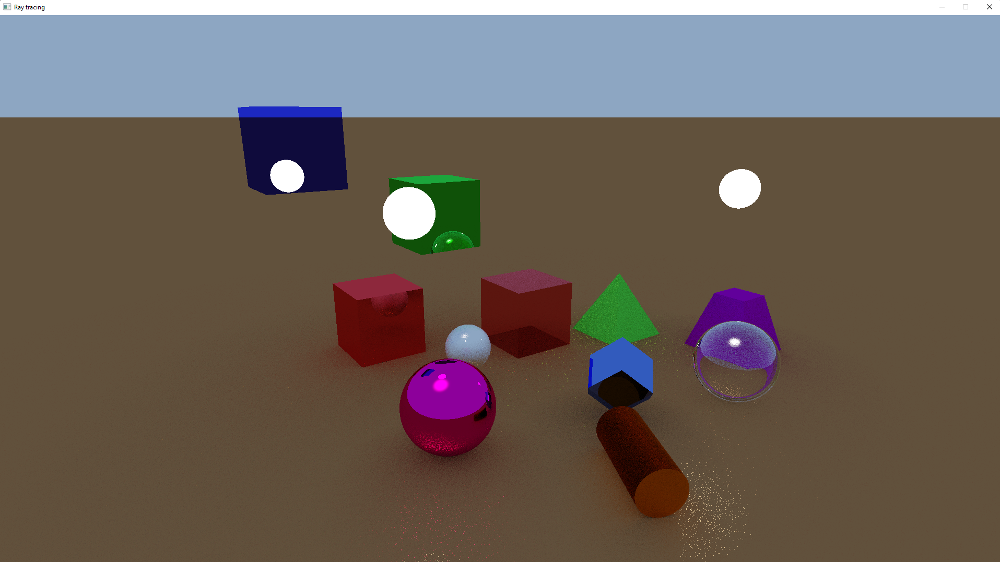
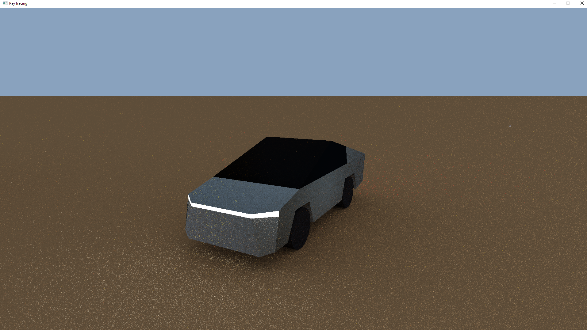
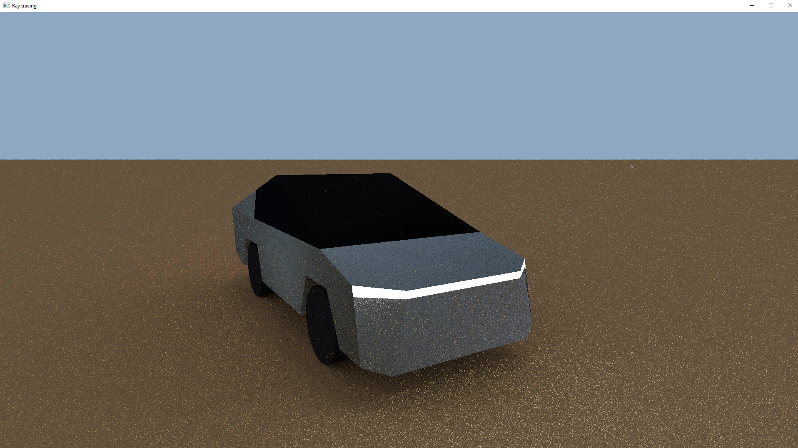
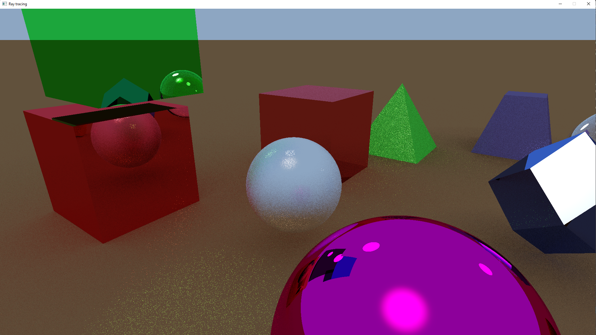
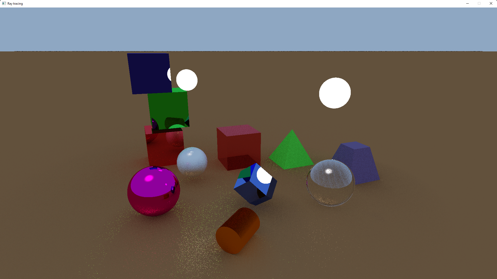
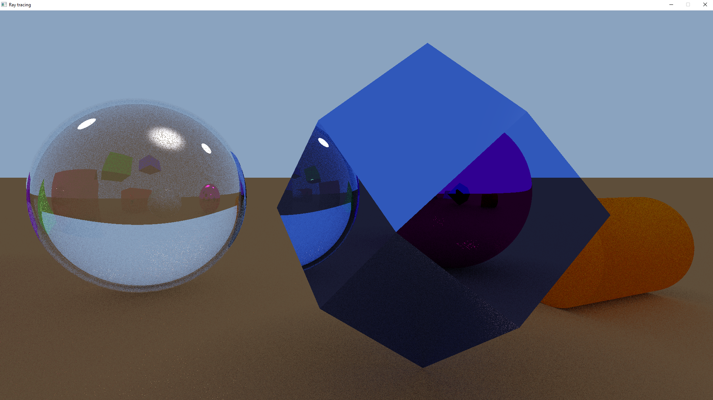
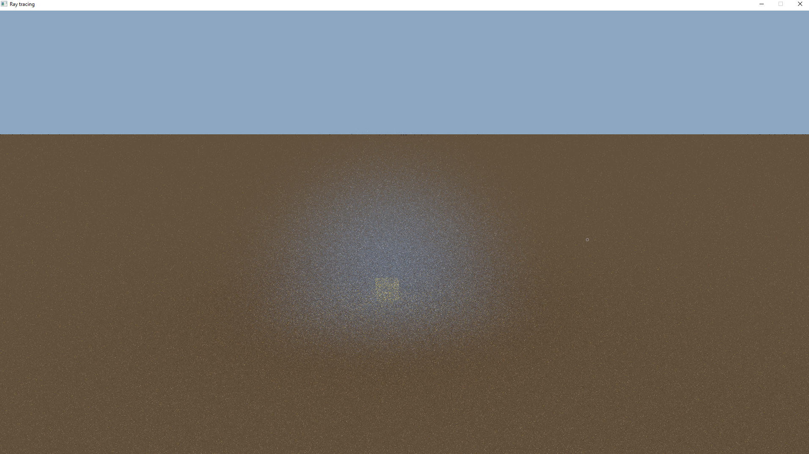

# RealTimeRayTracing

Here are some improvements for ArtemOnigiri's RealTimeRayTracing project.

## My improvements:

1. Added ability to create triangles. Thanks to this, it became possible to create complex 3D models. For example, I created 3D model of Tesla CyberTruck from 80 triangles.

2. Added ability to create cyclic animations for objects. Using animations you can change positions of objects, their size, color and surface reflectivity.

3. Improved performance and image quality. Demo images show a render on NVIDIA GeForce GTX 1650 in 30 samples at 15 FPS.

4. Added system for automatic dynamic adjustment of image quality in accordance with capabilities of your GPU.

5. Added fog simulation. You can change its color, density and cloud size.

6. Added dynamic light source on the scene.
7. Added ability to create cylinders.