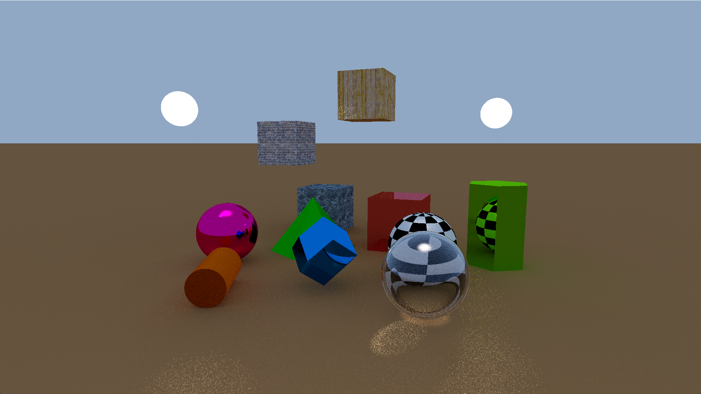
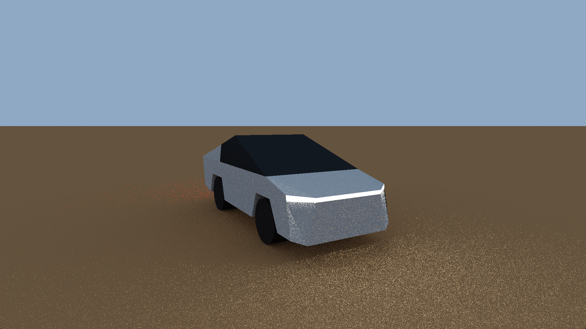
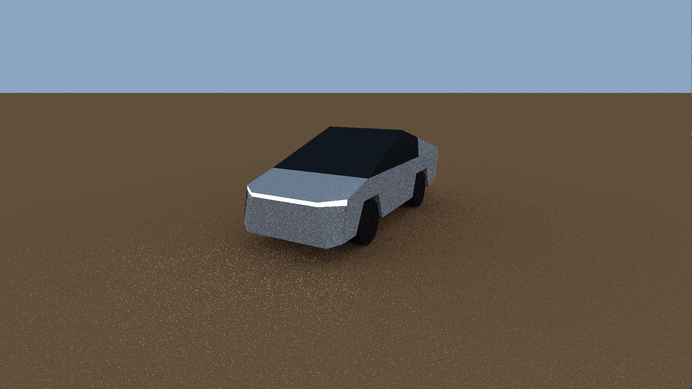
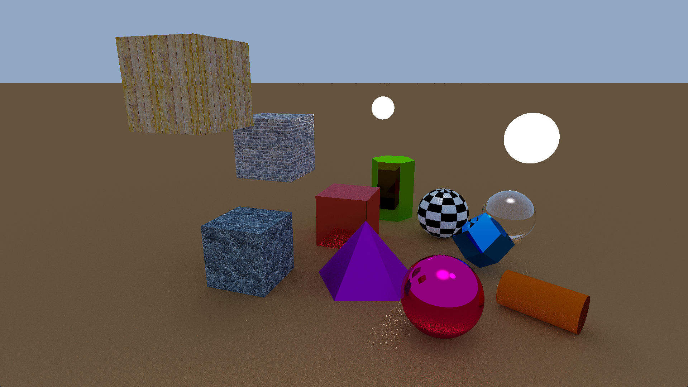
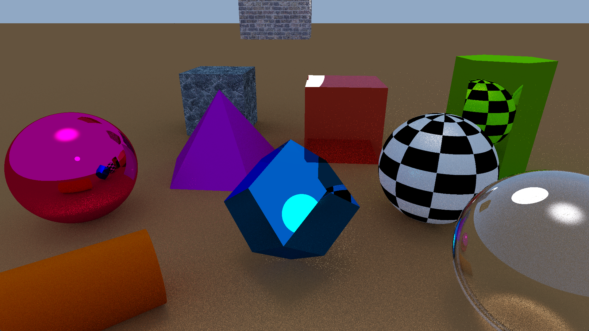
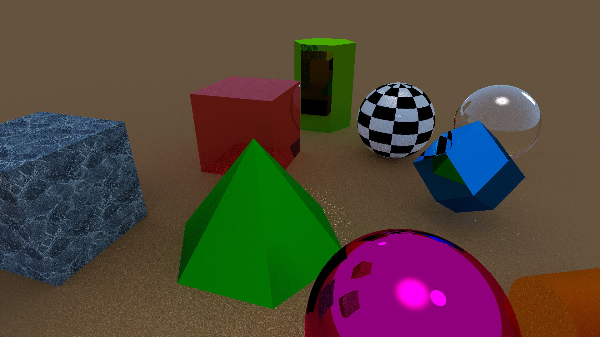

# Real Time Ray Tracing

A real-time ray tracing algorithm that allows you to render 3D models, create animations, and map textures.

## Polygons

Polygon rendering is supported, so you can create complex 3D models. For example, I created a 3D model of Tesla Cybertruck from 80 polygons.

Also added the ability to quickly and conveniently create pyramids and prisms with a configurable number of faces.

## Texturing

Texture mapping is supported. 
Depending on the geometry of the object, you can choose one of the texturing methods (planar, cylindrical or spherical) in order to get the best result.

## Animations

You can create an animation for each object in the scene. This allows you to dynamically change the properties of an object, such as position, size, and color. 
Also you can rotate objects or move them in a circular orbit by a special function.

## Optimization

The performance of the program is quite high. On NVIDIA GeForce GTX 1650 rendering at 15 frames per second is performed with 30 samples per pixel. 
This performance is due to the optimization of rendering multi-polygonal objects. The intersection of the ray with each of the polygons of the object is calculated only if the ray has an intersection with the invisible sphere in which this object is located.
The number of samples per pixel is adjusted automatically depending on the FPS to achieve the best balance between image quality and rendering speed.

## Other

The rendering quality has been improved.
Added day and night shift.
Cylinder rendering is supported.

